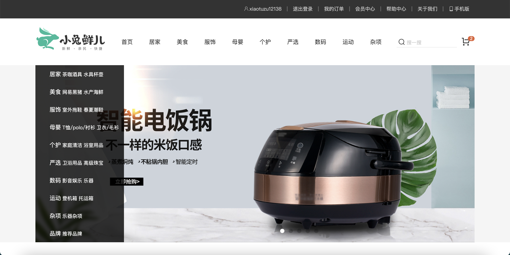

# PC端项目: 小兔鲜



## 项目简介

## 技术栈
* 前端: Vue3

## 功能模块

| 路径              | 组件（功能）   | 嵌套级别 |
| :---------------- | :------------- | :------- |
| /                 | 首页           | 1级      |
| /category/:id     | 一级分类       | 1级      |
| /category/sub/:id | 二级分类       | 1级      |
| /goods/:id        | 商品详情       | 1级      |
| /cart             | 购物车         | 1级      |
| /login            | 登录           | 1级      |
| /login/callback   | 第三方登录回调 | 1级      |
| /checkout/order   | 结算           | 1级      |
| /checkout/pay     | 支付           | 1级      |
| /pay/callback     | 支付结果       | 1级      |
| /member/home      | 个人中心       | 1级      |
| /member/order     | 订单页面       | 1级      |
| /member/order     | 订单列表       | 2级      |
| /member/order/:id | 订单详情       | 2级      |

## 项目构建
@vue/cli:vue脚手架

style-resources-loader:less文件自动注入

@vueuse/core:工具库 实现吸顶导航

## 项目运行
```
# 下载依赖
yarn install

# 运行
yarn serve

# 检查
yarn lint
```

